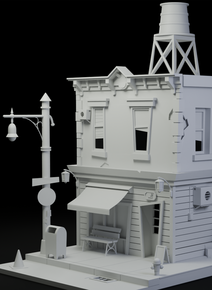

<table>
<tr>
<td valign="top" width="212">

</td>
<td valign="top">

<pre><code>╭─ heurte@github ─────────────────────────────────────────────────────────╮
│                                                                          │
│  status      Game Programming Graduate | 3d artist                       │
│  interests   game development, software engineering, retro computing,    │
│              computer graphics, programming languages                    │
│  currently   building games, tools and personal projects                 │
│  strengths   Unity, C#, C++, technical creativity, prototyping           │
│                                                                          │
╰─────────────────────────────────────────────────────────────────────────╯</code></pre>

</td>
</tr>
</table>

---

### highlights
- **[hsp](https://github.com/itsheurte/hsp-projets)** &emsp; &ensp; hsp projects

---

### tools lately

